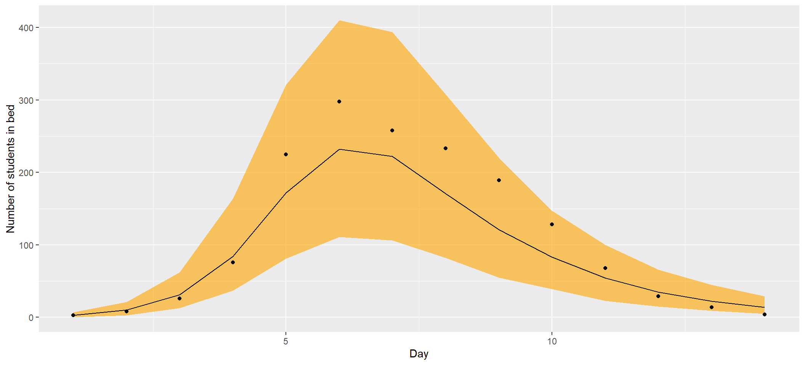
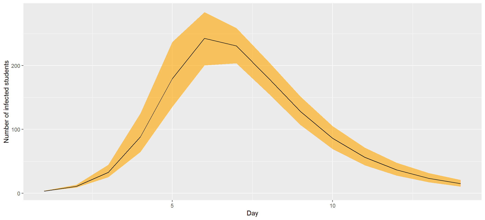

Disease transition modeling in stan
================
creation date: 29-07-2020, update date: 2020-12-03

  - [Remark](#remark)
  - [Introduction](#introduction)
      - [Outline](#outline)
      - [compartment models](#compartment-models)
      - [setup and reproducibility](#setup-and-reproducibility)
  - [Simple susceptile-infected-recovered model
    (SIR)](#simple-susceptile-infected-recovered-model-sir)
      - [data](#data)
      - [Mathematical transmission model](#SIR_model)
      - [statistical model](#statistical-model)
  - [Coding : Stan](#coding-stan)
      - [Coding ODEs in Stan](#coding-odes-in-stan)
      - [remaining Stan code blocks](#remaining-stan-code-blocks)
      - [complete program](#complete-program)
      - [checking the inference](#checking-the-inference)
      - [checking the model](#checking-the-model)
  - [Understand our model by simulated
    data](#understand-our-model-by-simulated-data)
      - [chechking our priors](#chechking-our-priors)
      - [Can our inference algorithm recover the right
        parameters?](#can-our-inference-algorithm-recover-the-right-parameters)
  - [References](#references)

# Remark

Although this note deals with epidemiological questions, it was written
to explain how to implement a model based on a system of differential
equations in `Stan`.

# Introduction

The following markdown file is inspired by the case study [Bayesian
workflow for disease transmission modeling in
Stan](https://mc-stan.org/users/documentation/case-studies/boarding_school_case_study.html).

## Outline

In this note we want to model the outbreak of a disease using a
compartment model, more precisely a Susceptible-Infected-Recovered (SIR)
model, and show how we can solve the corresponding systems of
differential equations in Stan.

In particular we will compute useful epidemilogical parameters as the
*basic reproduction rate*
.

1.  In section 1 we introduce how to build, fit and diagnose compartment
    models
2.  In section 2 we review how simulated data can be used to examine our
    model and priors and provide an introduction to inference
    calibration.
3.  In section 3 we do a pragmatic discussion on how to efficiently
    implement and scale up ordinary differential equations in Stan.

## compartment models

*Population based models* subdivide the total population into
homogeneous groups, which we call *compartments*. The flow between the
compartments can be described by a system of differential equations.

In our example the compartments are defined that their individuals are
in the same state, i.e. the individuals are

  - susceptible,
  - infected or have
  - recovered (or removed).

The time-dependent number of people in each compartment will be given as
the solution of a system of ordinary differential equations.

## setup and reproducibility

``` r
library(pacman)
p_load(
  tidyverse, 
  lubridate, # date time operations
  outbreaks, # data
  rstan, # use Stan in R
  survminer, # Kaplan meier plot
  gridExtra, # graphics
  DT # display tables
)

rstan_options (auto_write = TRUE)
options (mc.cores = parallel::detectCores ())

set.seed(3)

sessionInfo()
```

    ## R version 4.0.2 (2020-06-22)
    ## Platform: x86_64-w64-mingw32/x64 (64-bit)
    ## Running under: Windows 10 x64 (build 19041)
    ## 
    ## Matrix products: default
    ## 
    ## locale:
    ## [1] LC_COLLATE=German_Germany.1252  LC_CTYPE=German_Germany.1252   
    ## [3] LC_MONETARY=German_Germany.1252 LC_NUMERIC=C                   
    ## [5] LC_TIME=German_Germany.1252    
    ## 
    ## attached base packages:
    ## [1] stats     graphics  grDevices utils     datasets  methods   base     
    ## 
    ## other attached packages:
    ##  [1] DT_0.16              gridExtra_2.3        survminer_0.4.8     
    ##  [4] ggpubr_0.4.0         rstan_2.21.2         StanHeaders_2.21.0-6
    ##  [7] outbreaks_1.9.0      lubridate_1.7.9.2    forcats_0.5.0       
    ## [10] stringr_1.4.0        dplyr_1.0.2          purrr_0.3.4         
    ## [13] readr_1.4.0          tidyr_1.1.2          tibble_3.0.4        
    ## [16] ggplot2_3.3.2        tidyverse_1.3.0      pacman_0.5.1        
    ## 
    ## loaded via a namespace (and not attached):
    ##  [1] matrixStats_0.57.0 fs_1.5.0           httr_1.4.2         tools_4.0.2       
    ##  [5] backports_1.2.0    R6_2.5.0           DBI_1.1.0          colorspace_2.0-0  
    ##  [9] withr_2.3.0        tidyselect_1.1.0   prettyunits_1.1.1  processx_3.4.4    
    ## [13] curl_4.3           compiler_4.0.2     cli_2.2.0          rvest_0.3.6       
    ## [17] xml2_1.3.2         scales_1.1.1       survMisc_0.5.5     callr_3.5.1       
    ## [21] digest_0.6.27      foreign_0.8-80     rmarkdown_2.5      rio_0.5.16        
    ## [25] pkgconfig_2.0.3    htmltools_0.5.0    dbplyr_2.0.0       htmlwidgets_1.5.2 
    ## [29] rlang_0.4.8        readxl_1.3.1       rstudioapi_0.13    generics_0.1.0    
    ## [33] zoo_1.8-8          jsonlite_1.7.1     zip_2.1.1          car_3.0-10        
    ## [37] inline_0.3.16      magrittr_2.0.1     loo_2.3.1          Matrix_1.2-18     
    ## [41] Rcpp_1.0.5         munsell_0.5.0      fansi_0.4.1        abind_1.4-5       
    ## [45] lifecycle_0.2.0    stringi_1.5.3      yaml_2.2.1         carData_3.0-4     
    ## [49] pkgbuild_1.1.0     grid_4.0.2         parallel_4.0.2     crayon_1.3.4      
    ## [53] lattice_0.20-41    splines_4.0.2      haven_2.3.1        hms_0.5.3         
    ## [57] knitr_1.30         ps_1.4.0           pillar_1.4.7       ggsignif_0.6.0    
    ## [61] codetools_0.2-16   stats4_4.0.2       reprex_0.3.0       glue_1.4.2        
    ## [65] evaluate_0.14      V8_3.4.0           data.table_1.13.2  RcppParallel_5.0.2
    ## [69] modelr_0.1.8       vctrs_0.3.5        cellranger_1.1.0   gtable_0.3.0      
    ## [73] km.ci_0.5-2        assertthat_0.2.1   xfun_0.19          openxlsx_4.2.3    
    ## [77] xtable_1.8-4       broom_0.7.2        rstatix_0.6.0      survival_3.1-12   
    ## [81] KMsurv_0.1-5       ellipsis_0.3.1

# Simple susceptile-infected-recovered model (SIR)

A susceptile-infected-recovered model
[SIR](https://de.wikipedia.org/wiki/SIR-Modell) is a classical
epidemiological model to describe the outbreak of diseases with
immunization. It is named after its compartments, i.e. S, I, and R stand
for:

  - S - susceptible. These are people that are not infected with the
    disease yet. However, they are not immune to it either and so they
    can become infected with the disease in the future.

  - I - infected or infectious. These are people that are infected with
    the disease and can transmit the disease to susceptible people.

  - R - recovered. These are people who have recovered from the disease
    and are immune, so they can no longer be infected with the disease.

**Remark:** A [SEIR model](https://de.wikipedia.org/wiki/SEIR-Modell)
would include the latency stage, i.e. the time until an infected person
can infect others. We will show how to implement a SEIR model using Stan
in an upcoming note.

A complete discussion of a SIR-model is given in the subsection
[Mathematical transmission model](#SIR_model)

## data

In our example we are examine an outbreak of influenza A (H1N1) in 1978
at a british school. The data is freely available in the R package
`outbreaks` and consists of the daily number of students in bed spanning
over a time interval of 14 days.

There were 763 male students and 512 of them became ill. It is reported
that one infected boy started the epidemic, which spreads in the
relativly closed community.

We load the data and inspect it:

``` r
df <- influenza_england_1978_school
knitr::kable(df)
```

| date       | in\_bed | convalescent |
| :--------- | ------: | -----------: |
| 1978-01-22 |       3 |            0 |
| 1978-01-23 |       8 |            0 |
| 1978-01-24 |      26 |            0 |
| 1978-01-25 |      76 |            0 |
| 1978-01-26 |     225 |            9 |
| 1978-01-27 |     298 |           17 |
| 1978-01-28 |     258 |          105 |
| 1978-01-29 |     233 |          162 |
| 1978-01-30 |     189 |          176 |
| 1978-01-31 |     128 |          166 |
| 1978-02-01 |      68 |          150 |
| 1978-02-02 |      29 |           85 |
| 1978-02-03 |      14 |           47 |
| 1978-02-04 |       4 |           20 |

``` r
df %>% ggplot() + 
  geom_point(mapping = aes(x = date, y = in_bed)) +
  labs(y = "number of students in bed")
```

<!-- -->

## Mathematical transmission model

The susceptible-infected-recoved model (SIR) splits the population in
three time-dependent compartments:

  - the susceptible (infectable)
  - the infected (and infectious)
  - the recovered (and not infectious)

We assume when an susceptible individual comes into contact with an
infectious individual, the former becomes infected for some time.
Afterwards it recovers and beomes immune.

We model the above dynamics by the following system of ordinary
differential equations:

  
  

where :

  - ") is the
    number of people susceptible to becoming infected (no immunity),
  - ") is the
    number of people currently infected (and infectious),
  - ") is the
    number of recovered people (we assume they remain immune
    indefinitely),
  -  is the total number
    of the population,
  -  is
    the constant rate of infectious contact between people,
  - 
    the constant recovery rate of infected individuals.

The system of ODEs has the following intuition: The proportion of
infected people among the population is
, which can be considered as the probability of disease
transmission when a susceptible and an infected subject come in contact.
Let  be
the average number of contacts per person per time. At each time step,
assuming uniform contacts, the probability for a susceptible person to
become infected is
.

 is called force of infection and measures
the probability per time unit that a susceptible person becomes
infected.

Hence at each time step  susceptible individuals become infected and
hence  individuals leaving the compartment
 and  enter the compartment
.

Let 
denote the revovery rate. Hence the number of infected people decreases
with a speed of  and is
equal to the grows of the compartment
.

### Basic reproduction number

The number
 is called the *basic reproduction
number*. It measures the number of new infections are caused by one
infected person.

### initial conditions

The disease has started wich one infected individual which gives the
following initial conditions:

1.   = N -1")
2.  $I(0) = 1 $
3.   = 0")

### model assumptions

The above model holds under the following assumptions:

  - Birth and deaths are not contributing to the dynamics and the total
    population
     is constant.
  - Recovered individuals do not become susceptible again over time.
  - The infection rate
     and
    recovery rate
    
    are constant.
  - The population is homogeneous.
  - Individuals meet any other individual uniformliy at random
    (homogeneous mixing) and recovery time follows an exponential
    distribution with mean
    .
  - eplacing the integer number of people in each compartement by a
    continuous approximation is legitimate (the population is big
    enough)

## statistical model

We can solve the system of differential equation, the SIR-model, for
example using a Runge-Kutta method. But beside the initial conditions
,I(0),R(0)") we have to chose values for the parameters
 and
.
This is the part were bayesian statistics is joining the party. So let
us recall some basics from bayesian statistics:

### Bayes rule

We recall some notation first: Let
 and
 be two events, then the
conditional probability of  given , denoted by
"),
is the likelihood of observing event
 given that
 is true. Then **Bayes
rule** is the following formula:

  
=\\frac{P(B|A)P(A)}{P(B)}.
")  

To understand Bayes rule bettter we slightly change our notation (point
of view): We denote by
 our hypothesis, given by our model, which is determined
by its parameters. It is up to you wether you read
 as hypothesis, model or parameter. Moreover we denote by
 our data.

Usually we ask a question like: How likely is hypothesis
 given the data
?

This question is equal to
") and Bayes rule, written in the new notation,

  
=\\frac{P(D|\\mathcal{H})P(\\mathcal{H})}{P(D)}
")  
tells us (some)how to compute it. But let us give an interpretation of
the formula first:

  - The **prior distribution**
    ") captures our intial beliefs, that the hypothesis
    is true or in other words how the values of the parameter are
    distributed.
  - The **posterior distribution**
    ") are our beliefs about the hypothesis after we
    saw the data.
  - The **likelihood distribution** or **sampling dsitribution**
    ") measures how likely it is to observe the data
     given the
    hypothesis
    .
  - ") is
    called the **marginal distribution**, which will not have an
    interpretation for us. My reason is, that for a pure mathematical
    point of view we do not need an interpretation, but for non
    mathematicians such an interpretation can be really helpful and in
    particular it can be used to bridge “mathematical gaps” and replace
    precise mathematical explaination, which are often useless for non
    mathematicians.

We remark that specifying a prior is a big advantage of the bayesian
approach, as it allows us to include expert knowledge, e.g. the recovery
time is positve and around a day.

### Sampling distribution

Assume the parameters and initial conditions are given, then the
compartment model defines a unique solution for each compartment,
including the number of infected people,
"). We want to link this solution to the observed data,
i.e. number of students in bed,
"), at each time point. As the latter is a noisy estimate of
the true number of infected people, we chose to model this number
") with a count distribution, precisely the negative binomial
distribution. This distribution allows us to use the observation
") as the expected value and account over-dispersion by the
parameter :

  
\\sim NegBin(I_{ODE}(t),\\phi).
")  

This gives us
") with the parameters of our model
").

### Prior distribution

Next we need to specify a prior distribution
") with
"). We will specify one for each of
the parameters.

We specify the recovery rate (truncated at 0, see code section) by

  

")  

which expresses our beliefs, that
 has
to be positive and the probability that the recovery time is bigger than
a day is a priori 90%. Of course we can change this prior according to
expert knowledge and if more information become available.

The “infection rate” is specified by   

")  
and will be truncated at 0 (see code section).

The prior of the inverse of the “dispersion” parameter is assumed to be
exponentially distributed:   

")  

### Predictions and derived quantities

After fitting the model we obtain the posterior distribution
") from which we can derive additional quantities of
interest, e.g. the basic repoduction number
. More precisely the bayesian inference
allows us to construct a posterior distribution for this quantity   
.
")  

We can also compute predictions by   
=\\int P(D_{pred}|\\mathcal{H})P(\\mathcal{H}|D)d\\mathcal{H}
")  
and we

# Coding : Stan

In this section show how a system of ordinary differential equations,
e.g. a susceptible-infected-recovered model (SIR), can be solved in
`Stan`. We assume that the reader has some basic knowledge about `Stan`
and/or `rstan`.

## Coding ODEs in Stan

Let the following ODE be given :

  

")  
where  are the *states*,
in our example ") and  is
the time. We denote the initial conditions by
 and
 and by
 the times
at which we evaluate the solution.

In order to specify an ODE in Stan, we first code
 in the `function
block`. This function must observe a strict signature:

    real[] f(real time, real[] state, real[] theta, real[] x_r, int[] x_i)

with

  - `time` ,
  - `state`, the volumnes of each compartment,
    
  - `theta`, variables used to compute
    , which depend on
    the model parameters,
  - `x_r`, real variables used to evaluate
    , which only depend
    on fixed data,
  - `x_i`, ingeter values used to evaluate
    , which only depend
    on fixed data.

In our example the ODE for the susceptile-infected-recovered model is
defined as follows:

    functions {
      real[] sir(real t, real[] y, real[] theta, 
                 real[] x_r, int[] x_i) {
    
          real S = y[1];
          real I = y[2];
          real R = y[3];
          real N = x_i[1];
          
          real beta = theta[1];
          real gamma = theta[2];
          
          real dS_dt = -beta * I * S / N;
          real dI_dt =  beta * I * S / N - gamma * I;
          real dR_dt =  gamma * I;
          
          return {dS_dt, dI_dt, dR_dt};
      }
    }

We will use one of Stan’s numerical integrators, Runge-Kutta of 4th/5th
order, to solve the set of equations.

The integrator call looks as follows:

``` 
    y = integrate_ode_rk45(sir, y0, t0, ts, theta, x_r, x_i);
```

with

  - `sir` is the name of the function that returns the derivatives
    ,
  - `y_0` is the initial condition,
  - `t_0` is the time of the initial condition,
  - `t_s` are the times at which we require the solution to be
    evaluated,
  - `theta, x_r, x_i` are arguments to be passed to
    .

Now we have all ingredients to solve our ODE.

Note that in our example, because we assume that the total population
remains constant, the three derivatives
 sum up to
. We can use this fact
to improve computational efficiency of the `sir` functions by deriving
the value of
 from
 and
 :

``` 
      real dS_dt = -beta * I * S / N;
      real dR_dt =  gamma * I;
      real dI_dt =  -(dS_dt + dR_dt);
```

## remaining Stan code blocks

We will now go through the remaining Stan code blocks.

We declare the data in the `data` block:

    data {
      int<lower=1> n_days;
      real y0[3];
      real t0;
      real ts[n_days];
      int N;
      int cases[n_days];
    }

where

  - `n_days` is the number of days we observed
  - `y0` is the vector of compartments

We code transforms of the data in the `transformed data block`. In this
example, we transform our data to match the signature of `sir` (with
`x_r` being of length 0 because we have nothing to put in it).

    transformed data {
      real x_r[0];
      int x_i[1] = { N };
    }

We next declare the model parameters. If some parameter are bounded, and
it is not already guaranteed by his prior, we use `<lower=a, upper=b>`
to specify this when declaring the corresponding parameter. This way we
can put a truncated prior distribution on a parameter.

    parameters {
      real<lower=0> gamma;
      real<lower=0> beta;
      real<lower=0> phi_inv;
    }

The parameters transform as follows:

    transformed parameters{
      real y[n_days, 3];
      real phi = 1. / phi_inv;
      {
        real theta[2];
        theta[1] = beta;
        theta[2] = gamma;
    
        y = integrate_ode_rk45(sir, y0, t0, ts, theta, x_r, x_i);
      }
    }

Given the ODE solution ,
the only thing left to do is to code the prior and sampling
distribution.

    model {
      //priors
      beta ~ normal(2, 1); //truncated at 0
      gamma ~ normal(0.4, 0.5); //truncated at 0
      phi_inv ~ exponential(5);
      
      //sampling distribution
      //col(matrix x, int n) - The n-th column of matrix x. Here the number of infected people
      cases ~ neg_binomial_2(col(to_matrix(y), 2), phi);
    }

Untangled from the inference, we can calculate the basic reproduction
number, , and
predictions for the number of cases in the `generated quantities` block:

    generated quantities {
      real R0 = beta / gamma;
      real recovery_time = 1 / gamma;
      real pred_cases[n_days];
      pred_cases = neg_binomial_2_rng(col(to_matrix(y), 2) + 1e-5, phi);
    }

## complete program

We put the `Stan` code into a string

``` r
sir_model <- "
functions {
  real[] sir(real t, real[] y, real[] theta, 
             real[] x_r, int[] x_i) {

      real S = y[1];
      real I = y[2];
      real R = y[3];
      real N = x_i[1];
      
      real beta = theta[1];
      real gamma = theta[2];
      
      real dS_dt = -beta * I * S / N;
      real dI_dt =  beta * I * S / N - gamma * I;
      real dR_dt =  gamma * I;
      
      return {dS_dt, dI_dt, dR_dt};
  }
}
data {
  int<lower=1> n_days;
  real y0[3];
  real t0;
  real ts[n_days];
  int N;
  int cases[n_days];
}
transformed data {
  real x_r[0];
  int x_i[1] = { N };
}
parameters {
  real<lower=0> gamma;
  real<lower=0> beta;
  real<lower=0> phi_inv;
}
transformed parameters{
  real y[n_days, 3];
  real phi = 1. / phi_inv;
  {
    real theta[2];
    theta[1] = beta;
    theta[2] = gamma;

    y = integrate_ode_rk45(sir, y0, t0, ts, theta, x_r, x_i);
  }
}
model {
  //priors
  beta ~ normal(2, 1);
  gamma ~ normal(0.4, 0.5);
  phi_inv ~ exponential(5);
  
  //sampling distribution
  //col(matrix x, int n) - The n-th column of matrix x. Here the number of infected people 
  cases ~ neg_binomial_2(col(to_matrix(y), 2), phi);
}
generated quantities {
  real R0 = beta / gamma;
  real recovery_time = 1 / gamma;
  real pred_cases[n_days];
  pred_cases = neg_binomial_2_rng(col(to_matrix(y), 2), phi);
}

"
```

and put the data in a list

``` r
# time series of cases
cases <- df$in_bed  # Number of students in bed

# total count
N <- 763;

# times
n_days <- length(cases) 
t <- seq(0, n_days, by = 1)
t0 = 0 
t <- t[-1]

#initial conditions
i0 <- 1
s0 <- N - i0
r0 <- 0
y0 = c(S = s0, I = i0, R = r0)

# data for Stan
data_sir <- list(n_days = n_days, y0 = y0, t0 = t0, ts = t, N = N, cases = cases)

# number of MCMC steps
niter <- 2000
```

We draw samples from the model by:

``` r
model <- stan(model_code = sir_model, data = data_sir, iter = niter, chains = 4)
```

Or we can construct an instance of S4 class stanmodel from a model
specified in Stan’s modeling language, which we stored in a file
`sir_negbin.stan`. This file simply contains above string.

``` r
model <- stan_model("sir_negbin.stan")
```

``` r
fit_sir_negbin <- sampling(model,
                data = data_sir,
                iter = niter,
                chains = 4)
```

## checking the inference

`Stan` gives us information to evaluate whether the statistical
inference is reliable. First we start with a summary table of the
results for the parameter of interest. Additionally we will see some
useful diagnostics, like `Rhat` and the effective sample size.

``` r
pars=c('beta', 'gamma', "R0", "recovery_time")
print(fit_sir_negbin, pars = pars)
```

    ## Inference for Stan model: sir_negbin.
    ## 4 chains, each with iter=2000; warmup=1000; thin=1; 
    ## post-warmup draws per chain=1000, total post-warmup draws=4000.
    ## 
    ##               mean se_mean   sd 2.5%  25%  50%  75% 97.5% n_eff Rhat
    ## beta          1.74    0.00 0.05 1.64 1.70 1.73 1.77  1.85  2005    1
    ## gamma         0.54    0.00 0.05 0.45 0.51 0.54 0.57  0.64  2670    1
    ## R0            3.22    0.01 0.28 2.74 3.04 3.20 3.38  3.83  2116    1
    ## recovery_time 1.86    0.00 0.16 1.56 1.75 1.85 1.95  2.21  2648    1
    ## 
    ## Samples were drawn using NUTS(diag_e) at Thu Dec 03 15:43:19 2020.
    ## For each parameter, n_eff is a crude measure of effective sample size,
    ## and Rhat is the potential scale reduction factor on split chains (at 
    ## convergence, Rhat=1).

Let us briefly discuss the output above :

  - The Gelman-Rubin diagnositc `Rhat` is close to 1, which is a
    necessary condition for convergence. According to [Brooks and
    Gelman,
    1998](%22General%20methods%20for%20monitoring%20convergence%20of%20iterative%20simulations.%20Journal%20of%20Computational%20and%20Graphical%20Statistics%207:%20434–455%22)
    an `Rhat`value bigger than 1,2 for any of the model parameters
    should indicate nonconvergence
  - The effective sample size `n_eff` is “large” the marcov chains
    should have explored the parameter space well.

Moreover a trace plot can be used to evaluate if the chains were able to
explore the parameter space or got stuck in an area:

``` r
traceplot(fit_sir_negbin, pars = pars)
```

<!-- -->

But we can also check the posterior distribution of our parameters of
interest for each marcov chain. Precisely we can check whether they
agree with one another or not:

``` r
stan_dens(fit_sir_negbin, pars = pars, separate_chains = TRUE)
```

<!-- -->

Let us recall the meaning of the parameters

  -  is
    the infection rate, assumed to be constant,
  - 
    is the recovery rate, assumed to be constant,
  -  is the
    (basic) reproduction number

## checking the model

As we have trust in our model, let us check its utility. Utility is
problem specific and can include the precise estimation of a quantity or
predicting future behaviors. In general, it is good to check if our
fitted model produces simulations that are consistent with the observed
data. This is the idea behind *posterior predictive checks*.

We sample predictions
 from
"). Then we use these samples to construct a fitted curve
for students in bed, together with the uncertainty, e.g. the 90%
interval, which means that 10% of the observed data is expected to fall
outside of this interval. This *posterior predictive check* allows us to
verify if the model captures the structure of the data:

``` r
smr_pred <- cbind(as.data.frame(summary(
  fit_sir_negbin, pars = "pred_cases", probs = c(0.05, 0.5, 0.95))$summary), t, cases)
# remove % in the col names
colnames(smr_pred) <- make.names(colnames(smr_pred)) 

ggplot(smr_pred, mapping = aes(x = t)) +
  geom_ribbon(aes(ymin = X5., ymax = X95.), fill = "orange", alpha = 0.6) +
  geom_line(mapping = aes(x = t, y = X50.)) + 
  geom_point(mapping = aes(y = cases)) +
  labs(x = "Day", y = "Number of students in bed")
```

<!-- -->

If we want to access the true number of infected people at each time,
and not just the number of students in bed, we use the latent variable
") for which
we have an estimation.

``` r
#number of infected for each day
params <- lapply(t, function(i){sprintf("y[%s,2]", i)}) 

smr_y <- as.data.frame(summary(fit_sir_negbin, 
                               pars = params, probs = c(0.05, 0.5, 0.95))$summary)
# remove % in the col names
colnames(smr_y) <- make.names(colnames(smr_y)) 

ggplot(smr_y, mapping = aes(x = t)) +
  geom_ribbon(aes(ymin = X5., ymax = X95.), fill = "orange", alpha = 0.6) +
  geom_line(mapping = aes(x = t, y = X50.)) + 
  labs(x = "Day", y = "Number of infected students")
```

<!-- -->

# Understand our model by simulated data

In our example we fitted a model to a well-understood data set. In
practice we must proceed mode cautiously and probe the behavoir of our
model and our inference algorithm. Here working with fake data can be
productive.

## chechking our priors

We can check our prior by computing the a priori probability of various
epidemiological parameters of interst. In our example we know from
domain knowledge that the replication rate
 of influenza is
typically between 1 and 2 and its recovery time
 is
approximately one week.

We want priors that allow for every reasonable configurations of the
data but exclude absurd scenarios, per our domain expertise. To check if
our priors fulfill this role, we can do a *prior predictive check*.

To conduct a prior predictive check, we take the same model as before,
put the parameters of interest in the `generated_quantities code` block,
and remove the sampling distribution term from the model. Without the
sampling distribution, the parameters are not fitted to the data and are
thus sampled from their prior distribution. The Stan code is thus the
same as the final Stan code, without

    cases~ neg_binomial_2(col(to_matrix(y), 2), phi);

We did this in a file `sir_prior.stan`. We will fit the model and sample
from it:

``` r
model_priorcheck <- stan_model("sir_prior.stan")
fit_sir_prior <- sampling(model_priorcheck,
                 data = data_sir, seed = 0, chains = 4)
```

This way we got samples from the prior distribution of the parameters,
which we can visualize. For example we can look at the distribution of
the  of the
recovery time :

``` r
s_prior <- rstan::extract(fit_sir_prior)
df_test <- tibble(r = s_prior$recovery_time)
ggplot(data = df_test) + 
  geom_histogram(mapping = aes(x = r), bins = 30) + 
  labs(x = "log(recovery time)") + 
  geom_vline(xintercept = 0.5, color = "red") + 
  geom_vline(xintercept = 30, color = "red") +
  scale_x_log10()
```

<!-- -->

The red bars showing bounds on the recovery time (1/2 day and 30 days).
Most of the probality mass is between the red bars but still more
extreme values are allowed, which means that our posterior can
concentrate outside the bars, if the data warrants it.

The same thing can be done with
 (again on a log
scale). Here the loose bounds are
 and


``` r
df_test <- tibble(r = s_prior$R0)
ggplot(data = df_test) + 
  geom_histogram(mapping = aes(x = r), bins = 30) + 
  labs(x = "log(R0)") + 
  geom_vline(xintercept = 0.3, color = "red") + 
  geom_vline(xintercept = 30, color = "red") + 
  scale_x_log10()
```

<!-- -->

## Can our inference algorithm recover the right parameters?

While there exist many theoretical guarantees for MCMC algorithms,
modelers should realize that these rely on a set of assumptions which
are not always easy to verify and that many of these guarantees are
asymptotic. This means they are proven in the limit where we have an
infinite number of samples from the posterior distribution. A very nice,
if advanced, review on the subject can be found in Roberts and Rosenthal
([2004](https://mc-stan.org/users/documentation/case-studies/boarding_school_case_study.html#ref-Roberts_mcmc_2004))

# References

TBD
